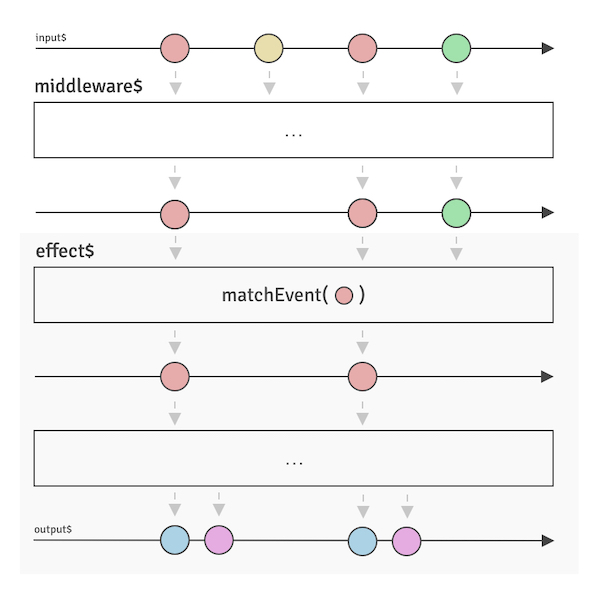

# Marble.js



## Philosophy

The core concept of **Marble.js** assumes that almost everything is a stream. The main building block of the whole framework is an Effect, which is just a function that returns a stream of events. With the big popularity of [RxJS](http://rxjs.dev) Observable, you can create a referential transparent program specification made up of functions that may produce side effects like network, logging, database access, etc. Using its monadic nature we can map I/O operations over effects and flat them to bring in other sequences of operations. RxJS is used as a hammer for expressing asynchronous flow with monadic manner.

Marble.js doesn't operate only over basic [HTTP](http/effects.md) protocol but can be used also for messaging purposes \(including [WebSocket](messaging/websockets.md), [microservices](messaging/microservices/), [CQRS](messaging/cqrs.md)\), where the multi-event nature fits best. Don't be scared of the complexity and abstractions — Marble.js framework, in general, is incredibly simple. For more details about its specifics, please visit the next chapters that will guide you through the framework environment and implementation details.

> _For those who are curious about the framework name - it comes from a popular way of visually expressing the time-based behavior of event streams, aka marble diagrams. This kind of domain-specific language is a popular way of testing asynchronous streams, especially in RxJS environments._


👉 If you have ever worked with libraries like [Redux Observable](https://redux-observable.js.org), [@ngrx/effects](https://github.com/ngrx/platform/blob/master/docs/effects/README.md) or other libraries that leverage functional reactive paradigm, you will feel like in home.



👉 If you don't have any experience with functional reactive programming, we strongly recommend to gain some basic overview first with [ReactiveX intro](http://reactivex.io/intro.html) or with [The introduction to Reactive Programming you've been missing](https://gist.github.com/staltz/868e7e9bc2a7b8c1f754) written by [@andrestaltz](https://twitter.com/andrestaltz).


## Previous articles





## Examples

If you would like to get a quick glimpse of a simple RESTful API built with Marble.js, visit the following link:



